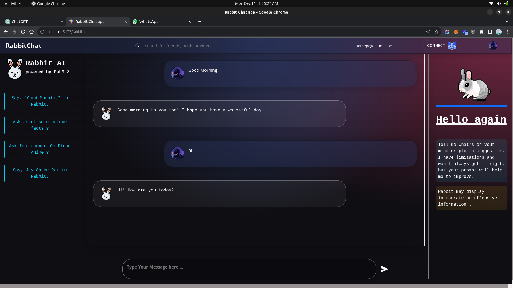
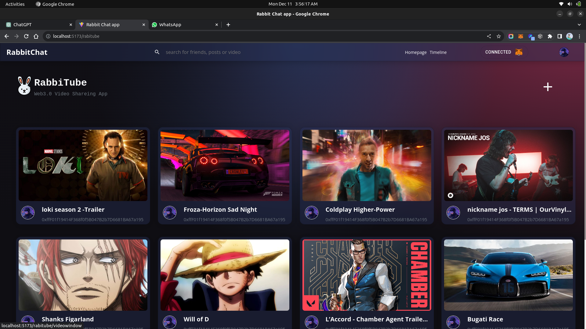

# Web3 Social Network 🚀

A decentralized social media platform leveraging AI (PalmAI) for content moderation/recommendations and Solidity smart contracts for secure transactions (e.g., tipping, NFT-based posts). Built with a modern tech stack for scalability and security.

## Key Features

- **AI-Powered Feed**: Personalized content using PalmAI.
- **Blockchain Integration**: Smart contracts for tipping/ownership (Ethereum/Polygon).
- **Web3 Auth**: Secure login via MetaMask/WalletConnect.
- **Real-Time Interactions**: WebSockets for chats/notifications.

## 🛠 Tech Stack

| Area            | Technologies Used                                     |
|-----------------|--------------------------------------------------------|
| **Frontend**    | React-Vite, TailwindCSS, Ethers.js                    |
| **Backend**     | Node.js, Express.js, WebSockets                       |
| **Database**    | MongoDB (NoSQL for user data)                         |
| **AI**          | Google PalmAPI (Moderation/Recommendations)           |
| **Blockchain**  | Solidity, Hardhat, IPFS (for media storage)           |

## 🌟 Why This Stands Out?

This platform combines cutting-edge technologies for a unique user experience:

- **AI-Powered Content**: PalmAI for personalized recommendations and content moderation.
- **Blockchain Integration**: Smart contracts for secure tipping and ownership transactions.
- **Web3 Authentication**: Login via MetaMask/WalletConnect for enhanced security.
- **Real-Time Interaction**: WebSockets for instant chat and notifications.
- **Decentralized Media Storage**: IPFS for secure, user-owned media storage.

A modern, decentralized social media platform with enhanced security and engagement.


## 📸 Screenshots

Here are some screenshots showcasing the features and user interface of the Web3 Social Network:







These images give you a glimpse into the core features and design of the platform.


## ⚙️ Installation

### Clone the repo:

```bash
git clone https://github.com/MangeshChate/web3-social-network.git
cd web3-social-network
```

### Install dependencies:

```bash
npm install
```

### Set up .env (example):

```env
MONGO_URI=your_mongodb_uri  
PALM_API_KEY=your_ai_key  
PRIVATE_KEY=your_wallet_key_for_smart_contracts
```

### Run the app:

```bash
npm run dev  # Frontend (Vite)
npm start    # Backend (Node/Express)
```


